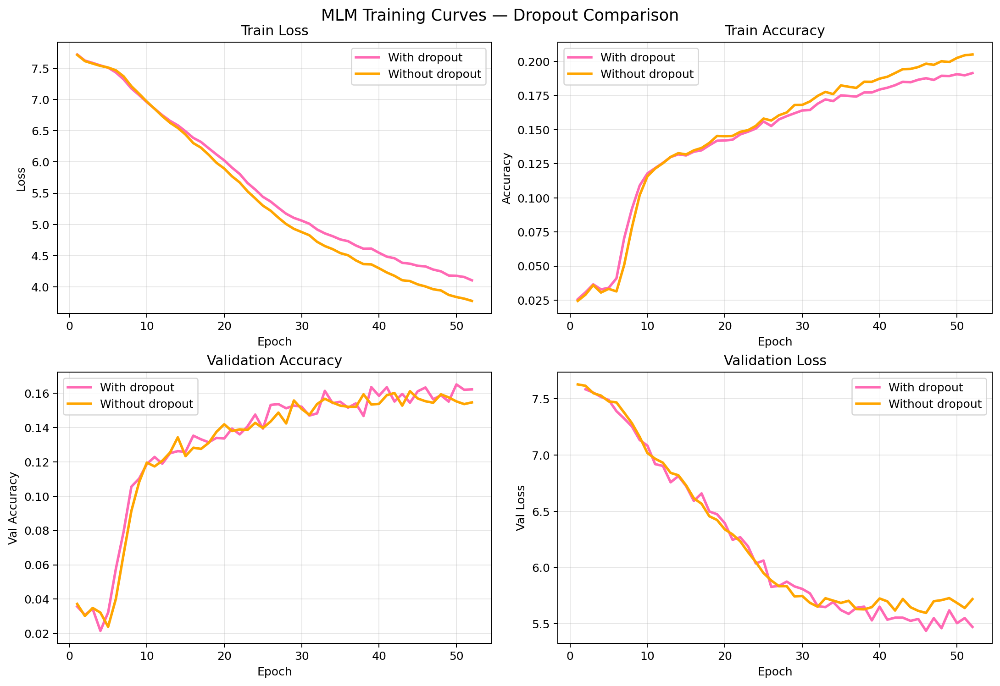
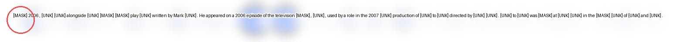

# Introduction
This is a mini Transformer for **masked language modeling** (MLM) using self-attention. It’s not meant to be state-of-the-art—just a clean, from-scratch implementation to show familiarity with the architecture. I trained on Google Colab (GPU) and include simple attention visualizations on text snippets.

## Project structure

mini-transformer/
├── src/
│   ├── layers.py         # SelfAttention, positional encodings, FeedForward, etc.
│   ├── transformer.py    # Encoder blocks + MaskedLanguageModel wrapper
│   ├── masking.py        # BERT-style 80/10/10 dynamic masking
│   ├── train.py          # Training loop + early stopping hooks
│   └── viz.py            # Print/overlay utilities for attention & preds
├── data/
│   ├── data.py           # DataLoaders for WikiText-2
│   └── tokenizer.py      # Simple word-level tokenizer + vocab
├── plots/                # Saved training curves / comparisons
└── README.md

## Constraints, Bottlenecks & Lessons

**Compute & data.** The main bottlenecks were dataset size and limited compute. Training time and memory scale roughly with the *square* of sequence length (self-attention is O(L²)), so I optimized for shorter sequences and smaller batches.

**Sequence length (`max_length`).** Longer contexts (e.g., 128) looked nice, but in practice many sequences were shorter, which meant lots of `[PAD]` tokens. That wastes compute, lowers the fraction of real tokens that get masked (and therefore supervised), and slows learning. Using `max_length=64` reduced padding and gave faster, more stable convergence.

**Vocabulary size.** I experimented with vocabularies from 2k up to 10k words. Larger vocabularies increased the softmax size and spread the gradient signal over many rare tokens, which the small model and dataset couldn’t learn well. In other words: more classes, sparser counts, weaker supervision. With 2k I got stronger signal per class (at the cost of more `[UNK]`), which worked better for this setup. (A better long-term fix is subword tokenization like BPE/WordPiece to keep the softmax small while reducing `[UNK]`.)

**Model capacity.** Very small models struggled to learn; the configuration I settled on (4 layers, d_model=256, 8 heads, FFN=512) was the smallest that consistently moved the validation metrics. Dropout improved generalization a bit vs. no dropout.

**Weight tying.** I tried tying the output projection to the input embedding. It reduced parameters but didn’t move validation much here (small vocab + small model). It’s still a sensible default; the benefit tends to grow with vocab size/scale.

**Time.** This was a one-week, evenings/weekend project. I prioritized clear baselines and end-to-end functionality (training, eval, attention viz) over hyperparameter sweeps.

### Practical takeaways
- Keep `max_length` just large enough for your data; avoid heavy padding (or use length bucketing/dynamic padding).
- If you’re resource-constrained, a **smaller vocab** with more `[UNK]` can actually train better than a huge word-level vocab; the real fix is **subword tokenization**.
- Dropout helps a bit; early stopping based on validation loss works well with dynamic masking.
- Weight tying; don’t expect miracles at this scale.

## Results
I trained the model **with** and **without** dropout in `SelfAttention` (see `layers.py`) and compared training/validation curves and qualitative predictions.

### Training dynamics (qualitative)

**Early epochs (≈1):** predictions are essentially random:

True vs Pred: while county
True vs Pred: be people
True vs Pred: brought herself
True vs Pred: on .

**Collapse phase:** the model briefly overpredicts a frequent token to reduce loss:
True vs Pred: It Fowler
True vs Pred: the Fowler
True vs Pred: make Fowler
True vs Pred: the Fowler
True vs Pred: 2011 Fowler
True vs Pred: its Fowler
True vs Pred: first Fowler

**Stabilization (a few epochs in):** diversity returns and guesses become plausible:
True vs Pred: the certain
True vs Pred: close sides
True vs Pred: Red Portuguese
True vs Pred: as wall
True vs Pred: a education
True vs Pred: complex mountain
True vs Pred: and island
True vs Pred: the the

**Later epochs (~50):** many masked tokens are predicted correctly:
True vs Pred: . status
True vs Pred: into across
True vs Pred: A A
True vs Pred: through across
True vs Pred: reported reported
True vs Pred: `(` was
True vs Pred: made made
True vs Pred: landfall landfall

### Curves

**Takeaway:** the run **with dropout** generalizes better: lower validation loss and a slightly higher validation accuracy. The no-dropout run shows a larger train–val gap (more overfitting).

### Attention examples

Each image shows an attention heatmap (blue blur) over the sentence; the **red ring** marks the masked token being predicted. Captions list the true token, the model’s prediction, and the top-5 alternatives.

  
**TRUE:** `In` • **PRED:** `In` (36.5%)  
Top-5: In 36.5%, BBC 9.6%, On 9.2%, The 3.0%, From 2.6%

  
**TRUE:** `–` • **PRED:** `–` (5.0%)  
Top-5: – 5.0%, Tour 3.4%, tour 2.9%, Hurricane 1.9%, Service 1.8%

**Temporal token confusion (still reasonable guesses):**

  
**TRUE:** `2000` • **PRED:** `October` (9.1%)  
Top-5: October 9.1%, February 5.5%, November 5.2%, 1994 4.2%, August 3.5%

**Near-miss semantic substitution:**

  
**TRUE:** `character` • **PRED:** `few` (9.1%)  
Top-5: few 9.1%, positive 3.1%, critical 2.9%, major 2.2%, TV 2.1%
